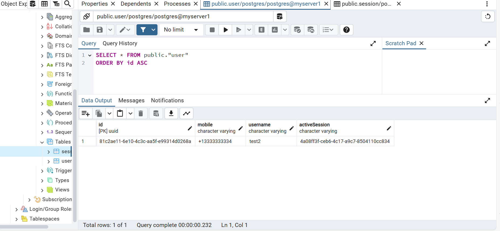
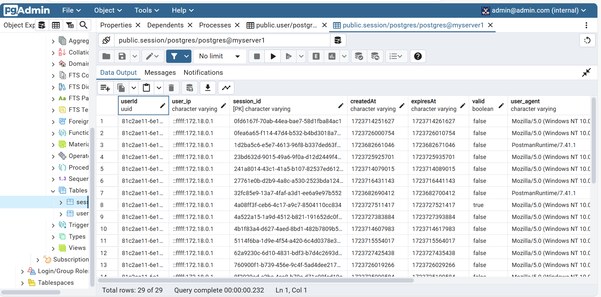

## Getting started

Clone the project and use Docker to run the server.

```bash
docker compose up
```

Server running on `http://localhost:3000`
PgAdmin server  `http://localhost:5050`

## Made using
- NestJS
- PostgreSQL
- Docker

PostgreSQL is the DB used to handle the user sessions and PgAdmin interface can be used by the admin to monitor and run SQL queries on the database.

There are 2 tables in the Database.
- Sessions
This table contains the data of the user sessions generated. At a time only single session is valid for the user to work with.

- User
This table contains data about the user and basic info about from where the server is accessed.

The User table has a One-to-Many relationship with the Sessions, and Sessions has Many-to-One relation with User.

## PgAdmin config

Credentials to login
- username: admin@admin.com
- password: password

In PgAdmin Connection tab include the config from docker-compose.yml

- address: db
- port: 5432
- Maintenance database: postgres
- Username: postgres
- password: password

Users Table


Sessions Table


## APIs
- GET `/users`
Fetches all the user data

- GET `/users/{mobile}`
Fetches the data of user with the specific mobile number

- POST `/users`
Can login or Register a new user.
Register requires both mobile number and username.